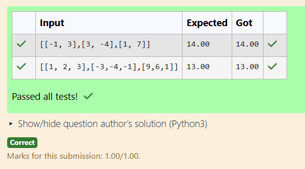
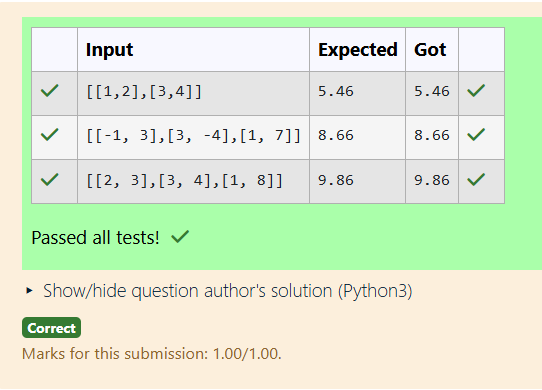
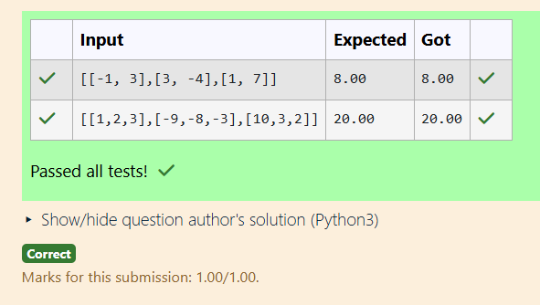

# Norm of a matrix
## Aim
To write a program to find the 1-norm, 2-norm and infinity norm of the matrix and display the result in two decimal places.
## Equipment’s required:
1.	Hardware – PCs
2.	Anaconda – Python 3.7 Installation / Moodle-Code Runner
## Algorithm to find 1-Norm of a Matrix:
1. Import the required libraries and set OPENBLAS_NUM_THREADS to "1".
2. Read the matrix input from the user.
3. Compute the 1-norm of the matrix using np.linalg.norm(matrix,1).
4. Display the calculated matrix norm formatted to two decimal places.

## Algorithm to find 2-Norm of a Matrix:
1. Import the required libraries and set OPENBLAS_NUM_THREADS to "1".
2. Read the matrix input from the user.
3. Compute the 2-norm of the matrix using np.linalg.norm(matrix,2).
4. Display the calculated matrix norm formatted to two decimal places.

## Algorithm to find Infinity Norm of a Matrix:
1. Import the required libraries and set OPENBLAS_NUM_THREADS to "1".
2. Read the matrix input from the user.
3. Compute the infinity norm of the matrix using np.linalg.norm(matrix, np.inf).
4. Display the calculated matrix norm formatted to two decimal places.

## Program:
```
# Register No: 212225240106
# Developed By: POPURI SAHITHYA
# 1-Norm of a Matrix
import os
os.environ["OPENBLAS_NUM_THREADS"]="1"
import numpy as np
matrix=eval(input())
one_matrix=np.linalg.norm(matrix,1)
print("{:.2f}".format(one_matrix))

# 2-Norm of a Matrix
import os
os.environ["OPENBLAS_NUM_THREADS"]="1"
import numpy as np
matrix=eval(input())
two_matrix=np.linalg.norm(matrix,2)
print("{:.2f}".format(two_matrix))

# Infinity Norm of a Matrix
import os
os.environ["OPENBLAS_NUM_THREADS"]="1"
import numpy as np
matrix=eval(input())
inf_matrix=np.linalg.norm(matrix,np.inf)
print("{:.2f}".format(inf_matrix))

```
## Output:
### 1-Norm of a Matrix


### 2-Norm of a Matrix


### Infinity Norm of a Matrix


## Result
Thus the program for 1-norm, 2-norm and Infinity norm of a matrix are written and verified.
